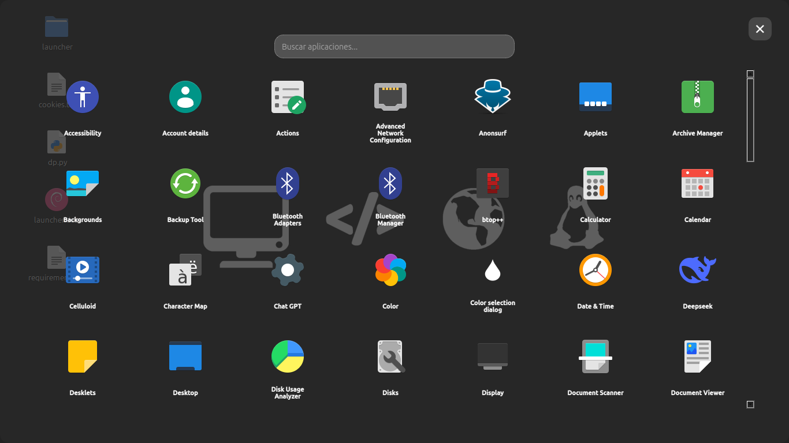

✨ Stable Launcher ✨
Tu Lanzador de Aplicaciones Elegante y Ultra-Rápido



🚀 ¿Por qué Stable Launcher?
🔍 Búsqueda Instantánea – Encuentra cualquier aplicación en milisegundos con un estilo "Spotlight" pero mejorado.

🎨 Interfaz Minimalista – Diseño transparente y elegante que se integra perfectamente con tu escritorio.

⚡ Lanzamiento Rápido – Abre apps con un solo clic o usando atajos de teclado inteligentes.

🌙 Modo Nocturno – Oscuro por defecto, pero con estilos personalizables.

## 🌈 Características Destacadas

| 🔥 **Potente**            | 🎨 **Bello**               |   🛠️ **Configurable**      |
|---------------------------|----------------------------|----------------------------|
| • Búsqueda en tiempo real | • Animaciones fluidas      | • Tema claro/oscuro        |
| • Acceso con `Ctrl+Space` | • Efectos de transparencia | • Personaliza columnas     |
| • Filtrado inteligente    | • Íconos nítidos           | • Ajusta tamaño de fuente  |


🛠️ Instalación en 3 Pasos

1️⃣ Clona el repositorio:
```bash
git clone https://github.com/tuusuario/stable-launcher.git
```
2️⃣ Instala dependencias:
```bash
cd launcher && pip install -r requirements.txt
```
o lo puedes hacer manual
```bash
sudo apt update
sudo apt install python3-pip
pip3 install -r requirements.txt
```
```bash
sudo apt update
sudo apt install python3 python3-pyqt5 python3-pyqt5.qtsvg xdg-utils qt5-style-plugins
```
```bash
sudo apt install pyqt5-dev-tools qt5-default make build-essential
```
3️⃣ Ejecuta con estilo:
```bash
python3 launcher.py --theme=dark
```
